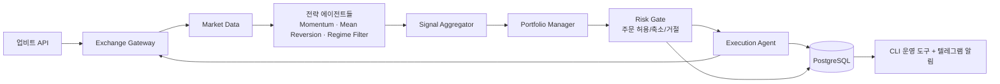

# 암호화폐 자동매매 멀티 에이전트 시스템

업비트 현물 시장에서 여러 전략 에이전트가 매매 신호를 만들고, 중앙 리스크 게이트가 승인한 주문만 실제로 체결되는 자동매매 시스템이다.

> ⚠️ 자동매매는 원금 손실, API 장애, 급변동, 슬리피지(주문을 넣은 가격과 실제 체결 가격의 차이), 계정 잠금, 규제/세무 이슈를 포함한 실질적 위험이 있다. 첫 버전은 반드시 모의투자(paper trading)로 시작하고, 출금 권한 없는 API 키만 사용한다. 이 문서는 설계 문서이며 투자 조언이 아니다.

## 해결하려는 문제

- 사람이 계속 차트를 보지 않아도 정해진 전략과 리스크 규칙에 따라 매매 후보를 감지한다.
- 여러 전략을 동시에 운영하면서도 계좌 전체 위험을 침범하지 않도록 통제한다.
- 실거래 전 backtest(과거 데이터 검증), paper trading(실제 주문 없는 모의 운영), 소액 실거래(live-small)를 같은 코드 경로에서 검증한다.
- 모든 판단 근거와 주문 결과를 추적 가능하게 저장한다.

## 큰 그림



전략 에이전트는 신호만 만들고 직접 주문하지 않는다. 모든 주문은 Risk Gate를 통과해야 실행된다.

## 짧은 용어 설명

- **backtest**: 과거 데이터로 전략을 시험하는 절차.
- **paper trading**: 실제 주문을 보내지 않고 가상 체결로 검증하는 모의 운영.
- **live-small**: 아주 작은 금액과 강한 한도로 시작하는 소액 실거래.
- **reconciliation**: 내부 기록과 거래소 실제 잔고·주문·체결을 다시 맞추는 작업.
- **idempotency**: 같은 요청이 여러 번 들어와도 주문이 중복 생성되지 않게 하는 성질.
- **look-ahead bias**: 아직 알 수 없던 미래 데이터를 전략 계산에 써서 결과가 좋아 보이는 착시.
- **spread**: 매수 호가와 매도 호가의 차이.
- **kill switch**: 위험 상황에서 신규 주문을 즉시 막는 긴급 중지 장치.

## 핵심 원칙 세 가지

1. **주문 권한은 중앙화한다.** 전략 에이전트는 거래소 API를 직접 호출하지 않는다. Execution Agent만 주문을 만든다.
2. **paper와 live-small은 같은 실행 경로를 공유한다.** 검증되지 않은 코드는 실거래 경로에 들어가지 않는다.
3. **모든 판단과 주문은 감사 가능해야 한다.** 신호, 리스크 판정, 주문, 체결을 append-only(기존 기록을 고치지 않고 새 기록만 추가하는 방식)로 기록한다.

전체 규칙은 [AGENTS.md](./AGENTS.md)에 있다.

## 기술 스택

- 언어/환경: Python 3.12+, `uv`
- 실행: CLI/worker, asyncio
- 저장소: PostgreSQL (TimescaleDB는 데이터가 커질 때 검토)
- 이벤트 처리: 초기에는 단일 worker 안의 큐와 DB 이벤트 로그 사용
- 거래소: 업비트 (현물 KRW 마켓)
- 알림: Telegram Bot

## 현재 단계

현재 Phase 0 (기획/설계) 단계다. 이 문서 세트는 Phase 1에 들어가기 위한 기준선이다.
세부 테이블, 파일명, CLI 옵션은 구현하면서 테스트와 업비트 API 제약에 맞춰 조정한다.
Phase별 범위와 체크리스트는 [docs/mvp.md](./docs/mvp.md)에 있다.

## 문서 지도

| 문서 | 읽는 사람 | 언제 본다 | 상태 |
|---|---|---|---|
| [AGENTS.md](./AGENTS.md) | AI 코딩 에이전트, 기여자 | 코드 쓰기 전에 반드시 | 규칙 기준선 |
| [docs/vision.md](./docs/vision.md) | 누구나 | 장기 방향과 post-MVP 백로그 | 방향 메모 |
| [docs/mvp.md](./docs/mvp.md) | 구현자 | 지금 무엇을 만들지 결정할 때 | MVP 기준선 |
| [docs/architecture.md](./docs/architecture.md) | 설계자, 구현자 | 컴포넌트 구조와 데이터 모델 볼 때 | 구조 기준선 |
| [docs/operations.md](./docs/operations.md) | 운영자 | 리스크/장애/승인/알림 정책 볼 때 | 운영 기준선 |

## 구현 후 사용할 기본 명령 후보

아래 명령은 `pyproject.toml`, 초기 실행 진입점, 디렉토리 구조가 만들어진 뒤에 사용할 기본 형태다.
실제 워커 모듈 경로는 구현하면서 조정할 수 있다.

```bash
uv sync                               # 의존성 설치
uv run pytest                         # 테스트
uv run ruff check                     # 린트
uv run ruff format                    # 포맷
uv run python -m apps.worker.main     # 워커 실행
```

자세한 개발 규칙은 [AGENTS.md](./AGENTS.md#5-코드-스타일)를 본다.
