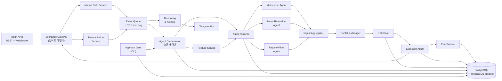
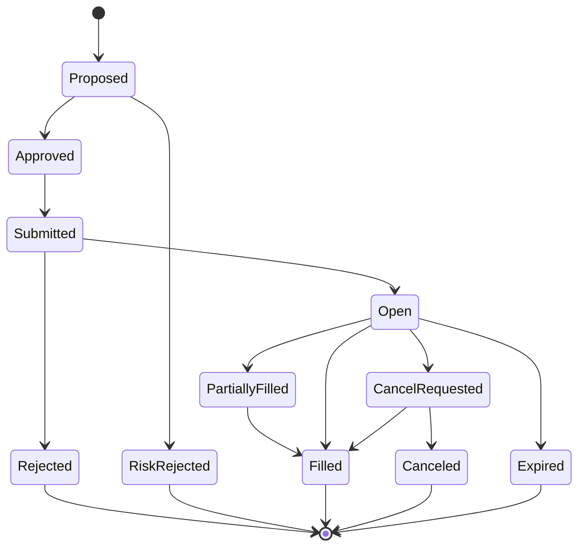

# Architecture — 구조 설계

이 문서는 **시스템이 어떻게 구성되어 있는가**를 설명한다. 권한·금지·코드 스타일은 [AGENTS.md](../AGENTS.md)에, 운영 정책은 [operations.md](./operations.md)에, 구현 범위는 [mvp.md](./mvp.md)에 있다.

MVP 범위에 한정한 설명이다. 첫 구현은 단일 worker를 기준으로 한다.
post-MVP 컴포넌트는 [vision.md](./vision.md)에서 다룬다.

이 문서의 인터페이스, 테이블, 디렉토리 목록은 첫 구현을 돕기 위한 후보와 책임 경계다.
상세 컬럼, 파일명, 메서드 이름, 서비스 경계는 구현 중 테스트와 업비트 API 제약에 맞춰 조정할 수 있다.
단, 주문 권한 경계와 Risk Gate 우회 금지 같은 안전 규칙은 [AGENTS.md](../AGENTS.md)를 따른다.

## 전체 다이어그램



전략 에이전트는 신호만 만들고, Risk Gate를 통과한 제안만 Execution Agent가 주문으로 바꾼다.

## 컴포넌트 요약

### Exchange Gateway

업비트 REST/WebSocket API와 내부 시스템 사이의 단일 어댑터다. MVP는 업비트 하나만 지원하지만 인터페이스는 다른 거래소로 확장 가능하게 단순하게 둔다.

**책임**: 인증/서명, 주문 생성·취소·조회, 잔고 조회, 체결 조회, 공개 시세 WebSocket 구독과 재연결, private 주문·자산 stream 정규화, rate limit/backoff, 업비트 에러를 내부 표준 에러로 변환한다.

Phase 1은 공개 시세 API만 사용하므로 API 키가 필요 없다. 계좌·주문 조회용 키는 Phase 3부터 Reconciliation Service와 Execution Agent 상태 확인에만 쓴다. 주문 생성·취소 메서드는 Execution Agent만 호출한다. 다른 컴포넌트는 조회 메서드만 쓴다.

아래 코드는 책임을 보여주는 예시다.
실제 메서드 이름과 반환 타입은 구현하면서 조정한다.

```python
class ExchangeGateway:
    async def stream_market_data(self, symbols: list[str]) -> AsyncIterator[MarketEvent]: ...
    async def stream_private_orders(self) -> AsyncIterator[OrderStateEvent]: ...
    async def stream_private_assets(self) -> AsyncIterator[BalanceSnapshot]: ...
    async def get_balances(self) -> list[Balance]: ...
    async def place_order(self, request: OrderRequest) -> OrderAck: ...
    async def cancel_order(self, exchange_order_id: str) -> CancelAck: ...
    async def get_open_orders(self, symbol: str | None = None) -> list[OrderSnapshot]: ...
    async def get_fills(self, since: datetime | None = None) -> list[Fill]: ...
```

업비트 API는 시세 조회(Quotation)와 거래/자산 관리(Exchange)로 나뉜다. 실시간 시세는 공개 WebSocket, 주문 생성·취소는 REST가 적합하다. 내 주문·체결과 자산 stream은 빠른 상태 반영을 돕지만, 최종 정합성은 REST reconciliation으로 확인한다.

### Market Data Service

원시 시장 데이터를 내부 이벤트로 표준화한다.

- **입력**: trade stream, ticker, orderbook L1/L2, OHLCV candle
- **출력 이벤트**: `MarketTick`, `TradePrint`, `OrderBookDelta`, `CandleClosed`
- **요구사항**: WebSocket 재연결, 중복 이벤트 제거, 누락 가능성 감지, REST snapshot + WebSocket delta 동기화, 이벤트 수신 시간과 거래소 event time 분리 저장.

### Feature Service

원시 데이터를 전략이 쓰기 쉬운 특징값으로 변환한다.

- returns, volatility, ATR
- moving averages (EMA 등)
- RSI, MACD 지표
- orderbook imbalance, spread, depth
- regime 라벨 (trend/range/high-vol/low-vol)

> **Regime 용어 정리**: 여기서 말하는 regime은 Feature Service가 계산하는 **라벨 값**(문자열 분류)이다. MVP의 Regime Filter Agent는 이 라벨을 참고하는 정량 전략 에이전트다. LLM 기반 Regime Research / Bull / Bear 에이전트는 post-MVP이며 [vision.md](./vision.md#먼-순위-연구-단계)에 있다.

**중요**: backtest와 실시간 운영(paper/live-small)이 **같은 feature 계산 코드**를 쓴다. candle close 이전 값은 사용하지 않는다 (look-ahead bias 방지).

### Agent Orchestrator

asyncio 기반 워크플로우 관리자다. 여러 서비스·에이전트를 정해진 순서로 실행하고, 재시도·타임아웃·중복 방지·trace 저장을 담당한다. **투자 판단을 하지 않고, 주문도 만들지 않는다.** 자세한 권한 경계는 [AGENTS.md](../AGENTS.md#3-권한-경계)를 참고한다.

**초기 워크플로우 후보**:

- `MarketDecisionWorkflow` — 시장 데이터가 들어왔을 때 전략 신호를 Risk Gate까지 전달한다.
- `RiskIncidentWorkflow` — 장애나 손실 한도 이벤트 발생 시 중지/알림을 처리한다.
- `DailyReportWorkflow` — 일일 성과와 위험 리포트를 생성한다.
- `ApprovalApplyWorkflow` — Approval Gate를 통과한 변경을 실제로 반영한다.

**구현 방향**: Python asyncio 기반 명시적 workflow 함수, 단일 worker 내부 큐, DB 이벤트 로그를 우선 검토한다.
`workflow_runs` / `workflow_steps` 같은 추적 구조와 timeout/retry 정책은 구현하면서 필요한 최소 범위부터 만든다.

Redis Streams 같은 외부 이벤트 버스는 여러 worker로 나눌 필요가 생긴 뒤에 도입한다.

#### `MarketDecisionWorkflow` 데이터 흐름 후보

하나의 시장 틱이 실주문이 되기까지 값이 어떻게 변환되는지 보여준다.
이 표는 책임 경계를 설명하기 위한 후보 흐름이다.
실제 내부 자료구조와 저장 시점은 구현하면서 조정할 수 있다.

| 단계 | 입력 | 출력 | 책임 컴포넌트 |
|---|---|---|---|
| 1 | `MarketTick` | `features` 행 | Feature Service |
| 2 | features + 계좌 상태 | `Signal` (에이전트별 복수) | Agent Runtime |
| 3 | `Signal[]` | `PortfolioIntent` | Signal Aggregator |
| 4 | `PortfolioIntent` + 보유·미체결·수수료 | `ProposedTrade` | Portfolio Manager |
| 5 | `ProposedTrade` | `RiskDecision` (APPROVED/REDUCED/REJECTED/PAUSED) | Risk Gate |
| 6 | `RiskDecision` (APPROVED/REDUCED) | `orders` + `client_order_id` | Execution Agent |

주요 필드 매핑:

```text
Signal.symbol            → PortfolioIntent.symbol              → ProposedTrade.symbol
Signal.target_notional   → (집계·한도 반영) → PortfolioIntent.target_notional
                                              → ProposedTrade.requested_notional
Signal.confidence        → (동일 가중치 점수 계산에 사용, PortfolioIntent에 저장 안 함)
Signal.max_slippage_bps  →                                        ProposedTrade.max_slippage_bps
PortfolioIntent.id       →                                        ProposedTrade.portfolio_intent_id
ProposedTrade.requested_notional → RiskDecision.original_notional
                                 → RiskDecision.approved_notional (REDUCED 시 축소)
RiskDecision.approved_notional   → Order.quantity × Order.price  (Execution)
```

REJECTED/PAUSED일 때는 주문 기록을 만들지 않고 리스크 이벤트와 알림으로만 흐른다.

### Agent Runtime

전략 에이전트를 실행하고 입력/출력 계약을 관리한다.

**에이전트 입력**: 현재 market state, feature snapshot, portfolio snapshot, risk budget, 최근 주문/체결 상태.

**에이전트 출력 예 (`Signal`)**:

```json
{
  "agent_id": "momentum_v1",
  "agent_version": "1.0.3",
  "symbol": "KRW-BTC",
  "intent": "BUY",
  "confidence": 0.63,
  "target_notional": "100000",
  "time_horizon_sec": 3600,
  "max_slippage_bps": 15,
  "reason_codes": ["ma_cross", "volume_confirmed"],
  "expires_at": "2026-04-19T03:30:00Z"
}
```

### Signal Aggregator

여러 에이전트 신호를 결합한다.

- 충돌 신호를 정리한다 (buy vs sell).
- MVP 기본값은 모든 전략 동일 가중치다.
- 신호 만료를 처리한다.
- 동일 방향 과밀 신호를 제한한다.
- 출력: `PortfolioIntent` (목표 비중 또는 주문 금액)

에이전트별 가중치를 운영 설정으로 바꾸는 기능은 도입하는 순간 Approval Gate 대상이다. MVP에서는 자동 점수나 학습 결과로 가중치를 바꾸지 않는다.

### Portfolio Manager

신호를 계좌 전체 관점의 목표 포지션으로 변환한다. 심볼별 최대 노출, 전체 위험 예산, 기존 미체결 주문, 수수료·최소 주문 단위를 반영한다. 출력은 `ProposedTrade`.

매도는 기존 현물 포지션을 줄이는 exit로만 만들 수 있다. 보유 수량과 미체결 매도 수량을 반영했을 때 순숏이 되는 `ProposedTrade`는 만들지 않는다.

### Risk Gate

실거래 전 마지막 방어선이다. **모든 주문은 Risk Gate를 통과해야 한다.** 구체 하드 룰과 한도는 [operations.md](./operations.md#리스크-룰)에 있다.

출력: `APPROVED` / `REJECTED` / `REDUCED` / `PAUSED`.

Risk Gate는 Portfolio Manager의 계산을 다시 검증한다. 매도 주문이 사용 가능 보유 수량을 넘거나 순숏을 만들 수 있으면 `REJECTED`로 기록한다.

### Execution Agent

Risk Gate를 통과한 거래 제안을 실제 주문으로 변환한다.

- 시장가/지정가/분할 주문을 선택한다.
- 주문을 생성하고 상태를 추적한다.
- 부분 체결을 처리하고, 타임아웃 시 취소한다.
- **idempotency key로 중복 주문을 방지한다.**
- 거래소 호출 전 `OrderRequest`와 `client_order_id`를 DB에 먼저 저장한다.
- 거래소 응답과 내부 상태를 다시 맞춘다.
- 주문 전 예상 수수료를 요청하고, 체결 후 실제 수수료를 저장한다.

DB에 주문 의도와 `client_order_id`를 저장하지 못하면 거래소 주문 API를 호출하지 않는다. 주문 제출 후 응답이 불명확하면 같은 의도에 새 `client_order_id`를 만들지 않고, 기존 식별자로 주문 상태를 조회한다.

**주문 상태 머신 후보**:

상태 이름과 세부 전이는 구현하면서 조정할 수 있다.
단, 현재 상태와 append-only 이벤트 이력을 함께 남겨야 한다.



### Upbit Fee Service

업비트 거래 수수료를 주문 전과 체결 후에 모두 계산한다.

**계산식**:

```
거래 수수료 = 체결금액 × 마켓별 거래수수료율
체결금액 = 체결수량 × 체결가격

매수 정산: 체결금액 + 거래 수수료가 KRW에서 차감
매도 정산: 체결금액 - 거래 수수료가 KRW로 정산
```

**원칙**:

- 수수료율은 코드에 고정하지 않는다. 런타임 기준값은 `fee_rates` 테이블이다.
- `configs/fees.example.yaml`은 초기 seed와 운영자가 검토할 제안 입력의 예시로만 사용한다.
- `fee_rates` 스키마는 적용 기간(`effective_from`/`effective_to`)을 가진다.
- live-small 체결은 거래소가 돌려준 실제 수수료를 우선 사용한다.
- backtest/paper는 해당 기간의 `fee_rates`를 사용한다.
- 모든 금액, 가격, 수량, 수수료율 계산은 내부에서 `Decimal`로 처리한다.
- JSON 이벤트와 DB의 JSON payload에는 `Decimal` 값을 문자열로 직렬화한다.

수수료율 변경 절차(Approval Gate 승인, 이력 보존 방식, MVP 수동 점검)는 [operations.md](./operations.md#수수료율-변경-절차)에 있다.

### Reconciliation Service

내부 DB 상태와 거래소의 실제 상태를 주기적으로 맞춘다. MyOrder/MyAsset private WebSocket 단절, REST 응답 vs 내부 저장 실패, 부분 체결 누락, 수수료 반영 지연을 복구한다. 불일치 발견 시 **신규 주문 중지**.

private stream은 빠른 상태 반영 경로다. REST 기반 주문·잔고·체결 재조회가 최종 확인 경로이며, 둘이 다르면 REST reconciliation 결과와 감사 로그를 우선한다.

### Approval Gate

시스템 상태를 바꾸는 제안을 승인/거절하는 공통 관문이다. MVP는 **CLI만** 지원한다. 대시보드는 post-MVP다.

제안 본문과 승인/거절/적용 같은 상태 변화는 나중에 재구성할 수 있어야 한다.
초기 후보는 제안 본문을 `approval_proposals.payload_json`에 저장하고, 상태 변화를 `approval_events`에 append-only로 남기는 방식이다.
이렇게 해야 CLI에서 제안 내용을 다시 확인할 수 있고, 승인 기록을 나중에 재구성할 수 있다.

승인 대상 목록, 절차, CLI 사용법은 [operations.md §승인 절차](./operations.md#승인-절차-approval-gate)에 있다. 이 문서는 구조만 다룬다.

### Monitoring & Alerting + Telegram

운영 지표와 이상 이벤트를 감시하고, 등급에 따라 텔레그램으로 알린다. 구체 정책은 [operations.md](./operations.md#텔레그램-알림)에 있다.

---

## 실행 모드

같은 코드 경로를 공유하고, 설정과 broker만 다르다. 이 구조 덕분에 backtest에서 통과한 코드가 그대로 paper와 live-small에서도 돈다.

모드 식별자는 `backtest` / `paper` / `live-small`이다. 주문 경로에 들어가는 모드(`paper`, `live-small`)만 `client_order_id`에 기록된다. 별도의 개발용 프로파일 `dev`는 **모의 데이터 전용**이다. 실제 `configs/dev.yaml`은 로컬 파일이고, Git에는 예시 파일만 둔다. 어떤 거래소 API 경로에도 연결되지 않으며 `client_order_id`도 발급하지 않는다.

### Backtest

- 과거 데이터만 사용한다.
- 주문 체결은 시뮬레이터가 처리한다.
- 해당 기간의 `fee_rates` 수수료로 계산한다.
- 슬리피지 모델을 적용한다.

### Paper

- 실시간 시장 데이터를 사용한다.
- 실제 주문은 보내지 않는다. paper broker가 가상 체결한다.
- 수수료는 live-small과 같은 방식으로 차감한다.
- **live-small과 동일한 risk/execution 코드 경로를 사용한다.**

### Live-small

- 실제 주문을 전송한다.
- 업비트가 돌려준 실제 체결 수수료를 저장한다.
- 매우 작은 주문 한도를 적용한다.
- whitelist된 심볼만 거래한다.
- 일일 손실/주문 수/주문 금액 제한을 강하게 적용한다.

### Live (post-MVP)

MVP에서는 활성화하지 않는다. live-small에서 충분히 검증한 이후 별도로 판단한다.

---

## 데이터 모델 (MVP 핵심 기록 후보)

초기 마이그레이션에서 검토할 핵심 기록 후보만 나열한다.
테이블 이름, 컬럼 이름, 정규화 수준, 보조 테이블은 구현 중 조정할 수 있다.
단, 신호 → 리스크 결정 → 주문 → 체결 → 수수료 흐름을 나중에 재구성할 수 있어야 한다.

고급 학습/실험 테이블은 post-MVP에서 추가한다.
단, 재현성을 위한 최소 실험 기록은 MVP에 포함한다.

### 시장 데이터

- `market_events` — id, exchange, symbol, event_type, exchange_event_time, received_at, dedupe_key, sequence, payload_json
- `candles` — exchange, symbol, timeframe, open_time, close_time, open, high, low, close, volume
- `features` — symbol, timeframe, feature_time, feature_set_version, values_json

### 워크플로우와 에이전트

- `workflow_runs` — id, workflow_type, trigger_event_id, mode, status, idempotency_key, started_at, finished_at, error
- `workflow_steps` — id, workflow_run_id, step_name, actor, input_hash, output_hash, status, retry_count, started_at, finished_at, error
- `signals` — id, workflow_run_id, agent_id, agent_version, symbol, intent, confidence, target_notional, target_weight, reason_codes, expires_at, created_at
- `portfolio_intents` — id, workflow_run_id, symbol, target_weight, target_notional, source_signal_ids, reason_codes, created_at

### 주문·체결·포지션

- `proposed_trades` — id, portfolio_intent_id, symbol, side, requested_notional, requested_quantity, limit_price, max_slippage_bps, reason_codes, created_at
- `risk_decisions` — id, proposed_trade_id, decision, original_notional, approved_notional, reason_codes, created_at
- `orders` — id, client_order_id, exchange_order_id, exchange, symbol, side, order_type, price, quantity, status, created_at, updated_at (현재 상태 projection)
- `order_events` — id, order_id, client_order_id, event_type, from_status, to_status, source, payload_json, created_at (append-only)
- `fills` — id, order_id, exchange_fill_id, price, quantity, gross_amount, fee_rate, fee_amount, fee_currency, settlement_amount, filled_at
- `positions` — exchange, symbol, quantity, avg_entry_price, realized_pnl, unrealized_pnl, updated_at
- `balances` — exchange, currency, available, locked, total, snapshot_at

### 수수료

- `fee_rates` — id, exchange, market, symbol, fee_rate, effective_from, effective_to, source, source_url, verified_at, approved_by, approval_id, created_at
- `fee_events` — id, order_id, fill_id, exchange, symbol, side, gross_amount, fee_rate, fee_amount, fee_currency, settlement_amount, is_estimated, source, created_at

### 운영·승인·알림

- `risk_events` — id, severity, code, message, payload_json, created_at
- `approval_proposals` — id, proposal_type, status, requested_by, target_resource, payload_json, before_state_json, after_state_json, created_at, expires_at
- `approval_events` — id, proposal_id, event_type (REQUESTED/APPROVED/REJECTED/APPLIED/APPLY_FAILED), actor, source_channel, reason, before_state_hash, after_state_hash, created_at (append-only)
- `notification_events` — id, channel, severity, event_code, title, message, dedupe_key, status, retry_count, sent_at, error_message, created_at

### 실험 (MVP 최소)

- `experiments` — id, run_tag, code_version, strategy_version, data_start, data_end, config_hash, config_json, score_formula_version, score, gross_pnl, net_pnl, fee_total, sharpe, max_drawdown_pct, trade_count, status, rejection_reason, created_at

[post-MVP 백로그](./vision.md#post-mvp-백로그)에 해당하는 학습, 리뷰, 메모리, 자동 수수료 점검 테이블은 MVP에서 만들지 않는다.
필요해지면 해당 기능을 꺼낼 때 스키마를 새로 정의한다.
MVP Approval Gate는 제안과 승인 이벤트라는 두 기록을 최소 단위로 시작한다.

---

## 이벤트 스키마 (예시)

### MarketTick

```json
{
  "type": "MarketTick",
  "exchange": "upbit",
  "symbol": "KRW-BTC",
  "price": "95000000",
  "volume": "0.012",
  "exchange_event_time": "2026-04-19T01:00:01.123Z",
  "received_at": "2026-04-19T01:00:01.201Z",
  "dedupe_key": "upbit:trade:KRW-BTC:123456",
  "sequence": "123456"
}
```

### SignalCreated

```json
{
  "type": "SignalCreated",
  "agent_id": "momentum_v1",
  "agent_version": "1.0.3",
  "symbol": "KRW-BTC",
  "intent": "BUY",
  "confidence": 0.63,
  "target_weight": "0.08",
  "reason_codes": ["trend_up", "volume_confirmed"],
  "expires_at": "2026-04-19T02:00:00Z"
}
```

### RiskDecisionCreated

```json
{
  "type": "RiskDecisionCreated",
  "decision": "REDUCED",
  "symbol": "KRW-BTC",
  "requested_notional": "200000",
  "approved_notional": "50000",
  "reason_codes": ["daily_risk_budget_near_limit"]
}
```

### FeeCalculated

```json
{
  "type": "FeeCalculated",
  "exchange": "upbit",
  "symbol": "KRW-BTC",
  "side": "BUY",
  "gross_amount": "1000000",
  "fee_rate": "0.0005",
  "fee_amount": "500",
  "fee_currency": "KRW",
  "settlement_amount": "1000500",
  "is_estimated": false
}
```

### ApprovalDecisionCreated

```json
{
  "type": "ApprovalDecisionCreated",
  "proposal_type": "FEE_RATE_CHANGE",
  "proposal_id": "appr_20260419_001",
  "decision": "APPROVED",
  "decided_by": "operator_1",
  "source_channel": "CLI",
  "reason": "업비트 공식 수수료 페이지 확인",
  "decided_at": "2026-04-19T00:10:00Z"
}
```

---

## ID 생성 규칙 후보

로그 상관관계, 중복 방지, 감사 추적을 위해 주요 식별자가 필요하다.
아래 포맷은 초기 후보다. 실제 포맷은 구현하면서 조정할 수 있다.
단, 주문 중복 방지에 쓰는 ID는 생성 즉시 불변이어야 하며 재사용하지 않는다.

### client_order_id / Upbit identifier

- **초기 포맷 후보**: `{mode}-{yyyymmddHHMMSS}-{symbol}-{nonce6}`
- **예시**: `live-small-20260419143055-KRW-BTC-7f3a2c`
- **생성 위치**: Execution Agent가 주문을 거래소로 보내기 직전이다.
- **업비트 매핑**: live-small에서는 업비트 주문 생성 요청의 `identifier` 필드로 보낸다.
- **목적**:
  - 주문 제출 후 응답이 불명확할 때 같은 주문을 조회·취소할 수 있게 한다.
  - 주문↔워크플로우↔리스크 결정↔수수료 이벤트를 사람이 읽을 수 있는 형태로 묶는다.
- **안전 규칙**:
  - `mode`는 `paper` / `live-small` 중 하나로 시작한다. backtest는 시뮬레이터 내부 ID를 쓸 수 있고, dev는 주문 경로에 연결하지 않는다.
  - 날짜성 ID를 쓴다면 운영자가 읽기 쉽도록 **KST 기준**을 우선 검토한다.
  - DB와 이벤트 timestamp는 UTC로 저장하고, 운영 화면·리포트에서는 KST로 표시한다.
  - nonce는 동일 시각에 만들어진 ID가 충돌하지 않을 만큼 충분한 난수를 쓴다.
  - 한번 만든 `client_order_id`는 계정 전체에서 재사용하지 않는다.
  - 응답 불명 상태에서는 기존 `client_order_id`로 조회하고, 같은 의도에 새 ID를 발급하지 않는다.

### approval_id

- **초기 포맷 후보**: `appr_{yyyymmdd}_{seq3}`
- **예시**: `appr_20260419_001`
- **생성 위치 후보**: Approval Gate가 승인 제안을 만들 때다.
- **초기 규칙 후보**:
  - `seq3`은 해당 날짜(KST) 안에서 1부터 증가하는 3자리 일련번호다.
  - 하루 1000건을 넘으면 4자리로 확장한다. 이 시점에는 프로세스 자체를 검토한다.
  - `operations.md`의 `killswitch release --approval-id` 등 CLI 인자 포맷과 동일하다.

### workflow_run_id, signal_id, risk_decision_id, proposed_trade_id 등 내부 식별자

- **초기 포맷 후보**: UUIDv7 (시간 정렬 가능)
- **이유**: 정렬성과 충돌 방지를 동시에 얻기 위해. DB 인덱스에도 유리하다.
- **표기 후보**: 로그·알림에는 앞 8~12자만 잘라 쓴다. 전체 ID는 DB에서 확인한다.

### 생성 책임 후보 요약

| ID 종류 | 생성 컴포넌트 | 저장 위치 후보 |
|---|---|---|
| `client_order_id` | Execution Agent | 주문 기록 |
| `approval_id` | Approval Gate | 승인 제안 기록 |
| `workflow_run_id` | Orchestrator | 워크플로우 trace |
| `signal_id` | Agent Runtime | 신호 기록 |
| `proposed_trade_id` | Portfolio Manager | 거래 제안 기록 |
| `risk_decision_id` | Risk Gate | 리스크 결정 기록 |

---

## 저장소 구조 후보

아래 구조는 책임 경계를 설명하기 위한 예상안이다.
실제 디렉토리와 파일은 해당 Phase에서 코드가 필요해질 때 만든다.

```text
crypto-swarm/
  apps/
    worker/main.py          # CLI 명령과 백그라운드 워커 진입점
  trading/
    domain/                # 이벤트, 주문, 신호, 포트폴리오, 리스크, 수수료
    exchanges/             # 업비트 어댑터와 거래소 공통 인터페이스
    market_data/           # 실시간·과거 시장 데이터 수집
    features/              # 지표와 feature 계산
    agents/                # MVP 전략 에이전트
    orchestration/         # workflow, retry, idempotency
    approval/              # Approval Gate와 CLI
    portfolio/             # Signal Aggregator, Portfolio Manager
    fees/                  # 수수료율, 수수료 이벤트, 정산
    risk/                  # Risk Gate와 하드 룰
    execution/             # 주문 실행과 reconciliation
    backtest/              # backtest 엔진과 검증 도구
    paper/                 # paper broker
    infrastructure/        # DB, 큐, 알림, secret, logging
  migrations/
  experiments/
    results.tsv
  reports/
    daily/
  tests/
    unit/
    integration/
    simulation/
  configs/
    dev.example.yaml
    paper.example.yaml
    live-small.example.yaml
    alerts.example.yaml
    fees.example.yaml
  docker-compose.yml
  pyproject.toml
  uv.lock
  README.md
  AGENTS.md
  docs/
    vision.md
    mvp.md
    architecture.md
    operations.md
```

세부 파일은 해당 Phase에서 실제 코드가 필요해질 때 만든다.
빈 패키지를 미리 많이 만들지 않는다.
실제 운영값이 들어간 `configs/*.yaml`은 Git에 커밋하지 않는다.

---

## 기술 스택 (MVP)

- **Language**: Python 3.12+
- **Package manager**: uv
- **API**: 없음. 상태 조회 API가 필요해지면 별도 Phase에서 추가
- **Worker/runtime**: asyncio
- **Orchestration**: 자체 asyncio 기반 워크플로우 함수
- **Event handling**: 단일 worker 내부 큐 + DB 이벤트 로그
- **DB**: PostgreSQL
- **Cache/lock**: MVP에서는 필요할 때만 추가
- **Backtesting**: 자체 event-driven backtester
- **Data processing**: pandas
- **HTTP client**: httpx
- **Formatter/linter**: Ruff
- **Type checker**: pyright 또는 mypy
- **Secrets**: `.env`는 개발용만. 운영/live-small은 secret manager 또는 운영 환경 변수.
- **Deployment**: Docker Compose

TimescaleDB, Redis Streams, Redis lock 같은 확장 도구는 실제 병목이나 운영 요구가 생겼을 때 별도 Phase에서 결정한다.
자세한 내용은 [vision.md](./vision.md)를 참고한다.
